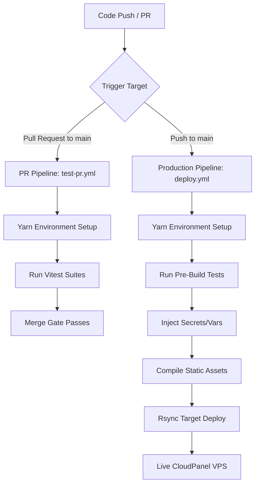

<div align="center">
  <h1 align="center">Tomás Hein | Senior Frontend Engineer</h1>
  <p align="center">
    My personal portfolio website built for speed, exceptional UX, and clean architecture.
    <br />
    <a href="https://github.com/tomashein/tomashein.dev/"><strong>Explore the code »</strong></a>
    <br />
    <br />
    <a href="https://tomashein.dev">Live Website</a>
    ·
    <a href="https://github.com/tomashein/tomashein.dev/issues">Report Issue</a>
  </p>
</div>

<div align="center">
  <h3>Pipeline & Quality Status</h3>

[](https://github.com/actions)
[](https://github.com/actions)

</div>

<div align="center">
  <h3>Core Architecture & Tooling</h3>

[](https://astro.build)
[](https://typescriptlang.org)
[](https://lightningcss.dev)
[](https://vitest.dev)

</div>

---

## 🛠️ Architecture & Tech Stack

This repository serves as a real-world benchmark of high-performance frontend engineering. It intentionally rejects framework abstraction overhead in favor of modern, native web platforms optimized via native binaries.

- **Core Engine**: [Astro](https://astro.build) (Static Site Generation with zero-JS baseline)
- **Language Layer**: [TypeScript](https://typescriptlang.org) (Strict mode verification)
- **Styles & Compilation**: Vanilla CSS + [Lightning CSS](https://lightningcss.dev) optimized through the [Vite](https://vite.dev) asset pipeline
- **Testing Suite**: [Vitest](https://vitest.dev) (Vite-native test runner leveraging shared compilation pipelines)
- **Code Quality**: [ESLint](https://eslint.org) & [Prettier](https://prettier.io) (Automated stylistic and programmatic analysis)
- **Package Manager**: [Yarn](https://yarnpkg.com) (Deterministic dependency locks)
- **CI/CD Infrastructure**: GitHub Actions delivering to a self-hosted **CloudPanel VPS**

---

## 📂 Project Structure

The codebase adheres to a highly modular structure designed to scale cleanly while keeping component logic separate from design tokens, supplemented by unified workspace configurations.

```text
├── .github/
│   └── workflows/         # Isolated CI/CD workflows for automated validation (PRs) and production delivery (Deploy)
├── .vscode/               # Workspace configuration files syncing extensions, formatters, and linting rules across environments
├── public/                # Static public assets (Favicons, robots.txt, manifests) served entirely untouched by the compiler
├── src/
│   ├── components/        # Highly modular, atomic UI components (Buttons, Cards, Navigation modules)
│   ├── content/           # Organized structural Markdown/MDX content schemas managing portfolio case studies and dynamic text
│   ├── helpers/           # Decoupled, type-safe pure JavaScript/TypeScript utility tools and global function pipelines
│   ├── layouts/           # High-level HTML structure layouts executing shell definitions and global metadata injections
│   ├── locales/           # Localization strings and translations managing multi-language architecture mappings (i18n)
│   ├── pages/             # File-based routing matrices (Astro pages mapping out static endpoints dynamically)
│   ├── scripts/           # Modular client-side scripts executing lightweight browser-side interactive behavior
│   ├── styles/            # Vanilla CSS architecture managed via Lightning CSS
│   │   ├── base.css       # Global element defaults, standard variables, layout tokens, and custom typing aesthetics
│   │   ├── index.css      # The primary configuration entrypoint orchestrating and injecting core cascade rules
│   │   ├── reset.css      # Aggressive baseline normalization stylesheet wiping browser-specific formatting defaults
│   │   └── utilities.css  # Atomic helper utility rules explicitly encapsulated to override targeted specific layout states
│   ├── content.config.ts  # Validation profiles strictly checking the formatting structure of the Astro content collection schemas
│   ├── env.d.ts           # Strict ambient TypeScript type overrides tracking custom types and process variables safely
│   └── site.config.ts     # Global SEO parameters, branding definitions, site mapping variables, and structural variables
├── tests/                 # Isolated Vitest software testing workspace running mirror paths matching src/ files
├── .editorconfig          # Cross-editor formatting parameters aligning tab settings and end-of-line guidelines
├── .env.example           # Secure template outlining layout variable models required locally without revealing raw values
├── .prettierrc            # Abstract structural blueprint managing Prettier parameters and code design tokens
├── astro.config.mjs       # Central compilation system configuration integrating Lightning CSS and specific builder settings
├── eslint.config.ts       # Type-safe, strict codebase programmatic rule check rules enforcing styling code standards
├── package.json           # Runtime operational scripts register, meta descriptions, and version-pinned dependencies
├── tsconfig.json          # Root configuration enforcing strict-mode type-checking constraints across compilers
└── vitest.config.ts       # Native test suite configuration sharing standard compilation setups with the Vite instance
```

---

## ⚡ Streamlined Developer Experience (DX)

To ensure strict engineering continuity and instant environment onboarding, specialized configuration profiles are maintained inside `.vscode/`:

- **Format & Lint on Save**: Instantly invokes ESLint and Prettier formatting engines dynamically upon file save hooks to prevent syntactic drifts.
- **Automated Extension Bootstrap**: Prompts developers to install business-critical environment extensions upon opening the workspace root directory, containing:
  - `astro-build.astro-vscode` (Native component syntax and language processing)
  - `dbaeumer.vscode-eslint` (In-line programmatic code validation)
  - `esbenp.prettier-vscode` (Unified AST layout formatting)

---

## 💅 Styling Architecture & Cascade Control

The design system uses standard web platform APIs processed at extreme speeds via a Rust-backed compiler:

- **Vite Integration**: Configured as both the primary CSS transformer and minifier inside `astro.config.mjs`, stripping out legacy PostCSS overhead entirely.
- **Encapsulated Architecture**: Utilizes explicit CSS Layers (`@layer reset, base, components, utilities`) to explicitly control specificity and maintain robust component boundaries.
- **Autoprefixing & Downleveling**: Automatically handles syntax translation (such as modern color spaces or native nesting) for legacy target systems using our `browserslist` profiles.
- **Custom Properties**: Employs semantic tokens for lightweight, system-wide dark/light transitions and design tokens.

---

## 🚀 Getting Started

Follow these instructions to configure your system environment variables and stand up the workspace locally.

### Prerequisites

- **Node.js**: `v24` (matches operational pipeline execution parameters)
- **Yarn**: Required deterministic package manager

### Environment Configuration

The application consumes runtime and compile-time variables for analytics and communications tracking. Create a `.env` file in your root project directory:

```env
PUBLIC_MAIL_URL="https://your-api-endpoint.com"
PUBLIC_MAIL_KEY="your_secure_public_mail_key"
PUBLIC_GTM_ID="GTM-XXXXXXX"
```

### Installation & Execution

1. Clone the codebase locally:
   ```bash
   git clone git@github.com:tomashein/tomashein.dev.git
   ```
2. Configure Yarn engine fallback tolerances:
   ```bash
   yarn config set ignore-engines true
   ```
3. Install project dependencies strictly matching the lockfile:
   ```bash
   yarn install --frozen-lockfile
   ```
4. Run the development workspace server:
   ```bash
   yarn dev
   ```

---

## 🧪 Testing Suite

Quality assurance is anchored by Vitest. Because it executes tests using your existing Astro/Vite configuration, components and native CSS modules parse perfectly with zero runtime configuration friction.

- Execute the production validation matrix locally:
  ```bash
  yarn test:run
  ```
- Run the suite in watch mode during development:
  ```bash
  yarn test
  ```

---

## 🔄 Automated CI/CD Pipelines

The infrastructure implements a decoupled design split into isolated code validation (`test-pr.yml`) and secure delivery deployment (`deploy.yml`) sequences.



### 1. Pull Request Validation (`test-pr.yml`)

Triggers automatically on any incoming pull request targeting the `main` branch.

- Validates package integrity utilizing `yarn install --frozen-lockfile`.
- Blocks the development merge workflow if any unit test suites fail via `yarn test:run`.

### 2. Production Deployment (`deploy.yml`)

Triggers automatically on direct push configurations or accepted merges to the `main` branch.

- Runs a final mandatory pre-build integration validation check (`yarn test:run`).
- Injects required operational parameters (`PUBLIC_MAIL_URL`, `PUBLIC_MAIL_KEY`, `PUBLIC_GTM_ID`) downstream directly into Astro's compiler space.
- Compiles static performance assets into the workspace output target directory (`dist/`) via `yarn build`.
- Connects using an encrypted SSH handshake via `rsync-deploy` to synchronize data payloads straight to the **CloudPanel VPS**, purging dead/stale assets automatically via `-avz --delete`.

---

## 🔑 Required Repository Environment Settings

To provision or duplicate this automated workspace orchestration layer, ensure the following specific configuration keys are provided:

### Repository Variables (`Settings > Actions > Variables`)

- `PUBLIC_MAIL_URL` — Destination tracking endpoint for portfolio contact processing.
- `PUBLIC_MAIL_KEY` — Client verification key string for public messaging forms.
- `PUBLIC_GTM_ID` — Google Tag Manager container asset identifier.

### Repository Secrets (`Settings > Actions > Secrets`)

- `VPS_SSH_KEY` — Raw text of your private secure shell key pair.
- `VPS_IP` — Server IPv4 target address.
- `VPS_PORT` — Production SSH connection port.
- `VPS_USER` — Isolated CloudPanel site username configuration owner account.
- `VPS_PATH` — Full absolute root server webspace path (e.g., `/home/username/htdocs/tomashein.dev/`).

---

## ✉️ Contact & Engagement

- **Interactive Portfolio**: [tomashein.dev](https://tomashein.dev) _(Includes secure contact form routing)_
- **Professional Networking**: [LinkedIn](https://www.linkedin.com/in/tomashein/)
- **Encrypted Mail Drop**: [Send Message via GitHub Relay](24785361+tomashein@users.noreply.github.com) _(Inbound messages are securely forwarded via GitHub privacy relays)_
